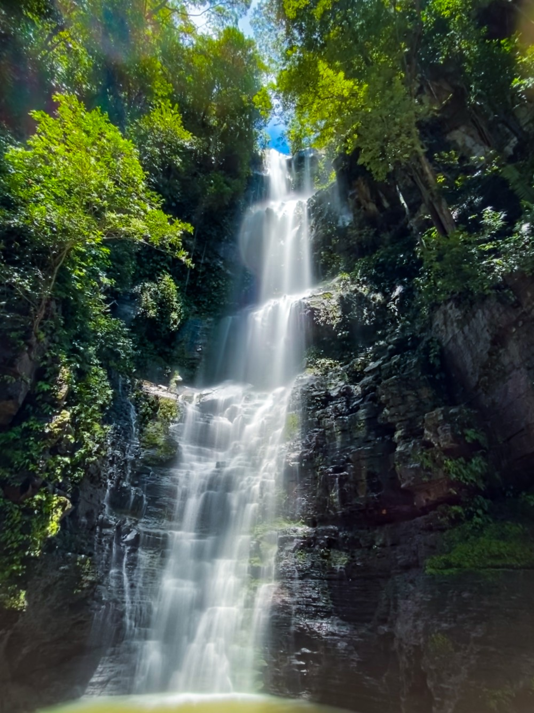

# 🗺️ TourP2 - Guia de Hospedagens em Pedro II - PI

Bem-vindo ao **TourP2**, o projeto integrador desenvolvido pela nossa equipe. Nosso objetivo é mapear, descrever e divulgar as principais
opções de hospedagem, chalés e pontos turísticos da cidade de Pedro II, no Piauí.

## 👥 Integrantes do Grupo
* Eduarda Reis
* Mirella Paixão
* Maria Ingrid
* Eluane Carreiro
* Gustavo Henrique

## 🏔️ Sobre o Projeto
Pedro II é conhecida por seu clima agradável, festival de inverno e riquezas naturais. Este projeto foi criado para ajudar turistas a encontrarem o lugar perfeito para se hospedar. O site reúne informações sobre:
* Casas de temporada
* Chalés aconchegantes
* Hotéis e pousadas
* Principais pontos de ecoturismo (cachoeiras e trilhas)

## 📸 Galeria de Fotos (Artefatos)
Aqui estão algumas das hospedagens e locais que mapeamos no projeto:

| Chalé da Serra | Cachoeira do Urubu Rei | Cachoeira do Salto Liso |
| :---: | :---: | :---: |
|  |  |  |

## 🖥️ Tecnologias Utilizadas
O projeto foi desenvolvido utilizando as seguintes tecnologias web:
* **HTML5:** Para a estruturação das páginas e textos.
* **CSS3:** Para a estilização, cores e design do site.

---
